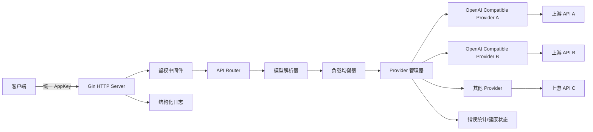
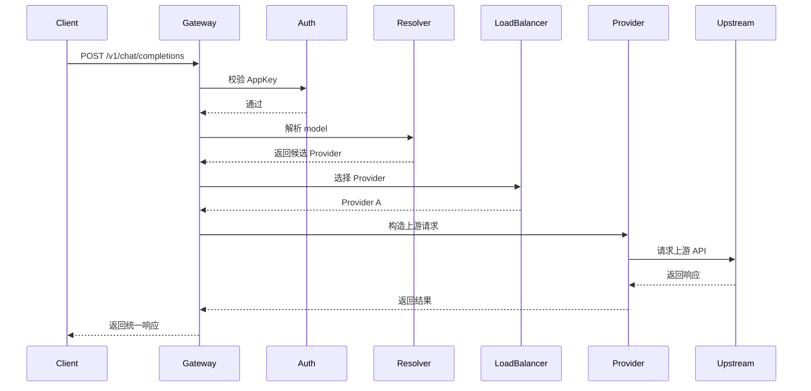
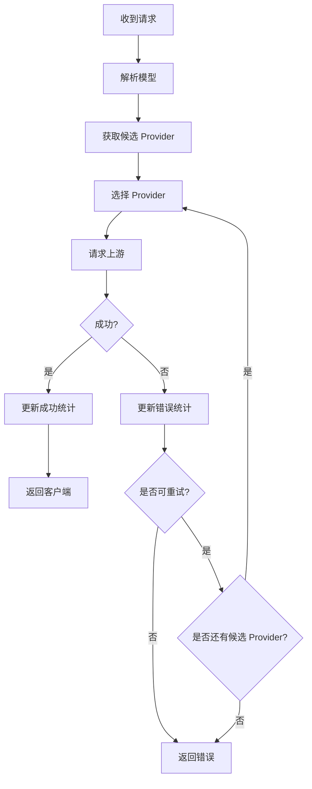

# AI Proxy Gateway 设计文档

## 1. 背景与目标

AI Proxy Gateway 是一个基于 Go + Gin 编写的 AI 服务代理网关。它对外提供统一的 OpenAI 兼容 API Endpoint 和统一的 AppKey 鉴权能力，对内对接多个不同的模型服务提供商，并根据配置的调度策略将请求转发给合适的上游提供商。

核心目标：

- 对外暴露统一的 API 地址，降低客户端接入成本。
- 支持多个上游 Provider，每个 Provider 可配置独立的 `baseURL`、`apiKey`、模型、参数和变体。
- 支持统一 AppKey 鉴权，避免直接暴露上游 Provider 的真实密钥。
- 支持按模型路由到不同 Provider。
- 支持轮询、最小错误数等负载均衡策略。
- 支持失败重试、错误统计和 Provider 健康状态管理。
- 尽量兼容 OpenAI 风格接口，方便现有客户端迁移。

## 2. 需求范围

### 2.1 功能性需求

| 模块 | 说明 |
| --- | --- |
| AppKey 鉴权 | 客户端通过 `Authorization: Bearer <app_key>` 或自定义 Header 访问网关 |
| Provider 配置 | 支持多个上游 Provider，每个 Provider 使用类似 `example.json` 的配置结构 |
| 模型聚合 | 网关聚合多个 Provider 的模型配置，对外展示统一模型列表 |
| 请求转发 | 将客户端请求转换并转发到目标 Provider 的兼容 API |
| 负载均衡 | 支持轮询、最小错误数策略 |
| 失败重试 | Provider 请求失败时可按策略切换其他 Provider 重试 |
| 错误统计 | 记录 Provider 维度的失败次数、连续失败次数和最后失败时间 |
| 健康检查 | 支持主动或被动维护 Provider 健康状态 |
| 流式响应 | 支持 SSE 流式响应透传 |
| 配置热加载 | 可选支持配置文件变更后重载 |
| 管理接口 | 可选提供 Provider 状态、模型列表、配置校验等管理能力 |

### 2.2 非功能性需求

- 高可用：单个 Provider 故障不应导致整体服务不可用。
- 可扩展：后续可以增加 Anthropic、Gemini、自定义 OpenAI Compatible Provider 等。
- 安全性：上游 API Key 不对客户端暴露；日志中避免输出敏感信息。
- 可观测性：提供结构化日志、指标和错误统计。
- 兼容性：优先兼容 OpenAI Chat Completions / Responses 风格接口。

## 3. 总体架构



核心链路：

1. 客户端携带 AppKey 请求网关。
2. Gin 中间件校验 AppKey。
3. API Handler 解析请求中的 `model`。
4. 模型解析器查找支持该模型的 Provider 列表。
5. 负载均衡器根据策略选择一个 Provider。
6. Provider Adapter 转发请求到上游。
7. 根据响应结果更新错误统计和健康状态。
8. 将上游响应原样或标准化后返回给客户端。

## 4. 对外 API 设计

### 4.1 兼容接口

第一版仅承诺兼容 OpenAI 风格的基础文本生成接口，避免范围过大导致项目膨胀。后续接口按需扩展。

| 方法 | 路径 | 说明 |
| --- | --- | --- |
| `GET` | `/v1/models` | 获取可用模型列表，MVP 必须支持 |
| `POST` | `/v1/chat/completions` | Chat Completions 接口，MVP 必须支持 |
| `POST` | `/v1/responses` | Responses 接口，可选 |
| `POST` | `/v1/embeddings` | Embeddings 接口，可选 |

MVP 暂不承诺兼容 `/v1/files`、`/v1/batches`、`/v1/fine_tuning`、`/v1/audio`、`/v1/images` 等接口。

### 4.2 管理接口

管理接口建议与业务接口隔离，可使用独立 Admin Key。为保持轻量化，MVP 只要求提供 `/healthz`，其他 `/admin/*` 接口放入后续阶段或通过配置开启。

| 方法 | 路径 | 说明 |
| --- | --- | --- |
| `GET` | `/healthz` | 服务存活检查 |
| `GET` | `/readyz` | 服务就绪检查 |
| `GET` | `/admin/providers` | 查看 Provider 状态 |
| `GET` | `/admin/models` | 查看聚合后的模型映射 |
| `POST` | `/admin/reload` | 重新加载配置 |
| `POST` | `/admin/providers/:name/reset-errors` | 重置某 Provider 错误统计 |

### 4.3 鉴权方式

客户端请求：

```http
Authorization: Bearer <gateway_app_key>
```

网关内部转发给上游时替换为上游真实 Key：

```http
Authorization: Bearer <provider_api_key>
```

## 5. 配置设计

### 5.1 配置文件结构

建议使用 YAML 或 JSON。由于示例为 JSON，初期可以直接兼容 JSON。

```json
{
  "server": {
    "addr": ":8080",
    "readTimeout": "60s",
    "writeTimeout": "300s",
    "upstreamTimeout": "120s"
  },
  "auth": {
    "appKeys": [
      {
        "name": "default-client",
        "key": "gw_xxx",
        "enabled": true,
        "models": ["gpt-5.5", "gpt-5.4"]
      }
    ],
    "adminKey": "admin_xxx"
  },
  "routing": {
    "strategy": "round_robin",
    "errorWindow": "5m",
    "retry": {
      "maxAttempts": 2,
      "perAttemptTimeout": "60s",
      "retryOnStatus": [429, 500, 502, 503, 504]
    }
  },
  "provider": {
    "openai-a": {
      "type": "openai-compatible",
      "enabled": true,
      "weight": 1,
      "options": {
        "baseURL": "https://provider-a.example.com/v1",
        "apiKey": "${PROVIDER_A_API_KEY}"
      },
      "models": {
        "gpt-5.5": {
          "name": "GPT-5.5",
          "upstreamModel": "gpt-5.5",
          "limit": {
            "context": 1050000,
            "output": 128000
          },
          "options": {
            "store": false
          },
          "variants": {
            "low": {},
            "medium": {},
            "high": {},
            "xhigh": {}
          }
        }
      }
    },
    "openai-b": {
      "type": "openai-compatible",
      "enabled": true,
      "weight": 1,
      "options": {
        "baseURL": "https://provider-b.example.com/v1",
        "apiKey": "${PROVIDER_B_API_KEY}"
      },
      "models": {
        "gpt-5.5": {
          "name": "GPT-5.5",
          "upstreamModel": "provider-b-gpt-5.5",
          "limit": {
            "context": 1050000,
            "output": 128000
          },
          "options": {
            "store": false
          },
          "variants": {
            "low": {},
            "medium": {},
            "high": {},
            "xhigh": {}
          }
        }
      }
    }
  }
}
```

### 5.2 与 `example.json` 的兼容关系

现有 `example.json` 中的核心结构为：

- `provider.<name>.options.baseURL`
- `provider.<name>.options.apiKey`
- `provider.<name>.models.<model>`
- `provider.<name>.models.<model>.limit`
- `provider.<name>.models.<model>.options`
- `provider.<name>.models.<model>.variants`

网关应保留这些字段，并额外扩展：

| 字段 | 说明 |
| --- | --- |
| `provider.<name>.type` | Provider 类型，例如 `openai-compatible` |
| `provider.<name>.enabled` | 是否启用 |
| `provider.<name>.weight` | 加权轮询时使用 |
| `provider.<name>.models.<model>.upstreamModel` | 上游真实模型名，不配置时默认等于外部模型名 |
| `routing.strategy` | 全局路由策略 |
| `routing.errorWindow` | 最小错误数策略使用的错误统计时间窗口 |
| `routing.retry` | 重试策略 |
| `auth.appKeys` | 网关 AppKey 配置 |

同一个外部模型可以由多个 Provider 同时提供。客户端请求 `model = gpt-5.5` 时，网关会查找所有支持 `gpt-5.5` 的 Provider，再根据 `round_robin`、`least_errors` 等策略选择一个上游。如果某个 Provider 的真实模型名不同，则转发前将请求体中的 `model` 改写为该 Provider 配置的 `upstreamModel`。

配置中的密钥字段支持环境变量展开，例如 `${PROVIDER_A_API_KEY}`。加载配置时，如果字段值符合 `${ENV_NAME}` 格式，则从环境变量读取真实值。日志和错误输出中不得打印展开后的完整密钥。

## 6. 核心模块设计

### 6.1 HTTP Server 模块

职责：

- 初始化 Gin Engine。
- 注册中间件：日志、Recovery、鉴权、请求 ID、限流等。
- 注册业务 API 和管理 API。
- 处理非流式响应和流式响应。

建议目录：

```text
internal/server
internal/handler
internal/middleware
```

### 6.2 配置模块

职责：

- 加载 JSON/YAML 配置。
- 校验必填字段。
- 解析 Provider、模型、AppKey 和路由策略。
- 提供只读配置快照。
- 可选支持热加载。

建议接口：

```go
type Loader interface {
    Load(path string) (*Config, error)
}
```

### 6.3 鉴权模块

职责：

- 从 `Authorization` Header 解析 AppKey。
- 校验 AppKey 是否存在、是否启用。
- 校验该 AppKey 是否允许访问请求模型。
- 将 AppKey 信息写入 Gin Context。

鉴权失败返回：

| 场景 | 状态码 |
| --- | --- |
| 未携带 Key | `401` |
| Key 无效 | `401` |
| Key 被禁用 | `403` |
| 无权访问模型 | `403` |

### 6.4 模型解析模块

职责：

- 根据请求体中的 `model` 字段查找可用 Provider。
- 支持模型别名映射。
- 根据 AppKey 权限过滤模型。
- 判断模型是否启用。

模型映射示例：

```text
外部模型名: gpt-5.5
Provider A 上游模型名: gpt-5.5
Provider B 上游模型名: provider-b-gpt-5.5
```

### 6.5 负载均衡模块

职责：

- 接收候选 Provider 列表。
- 根据策略选择目标 Provider。
- 排除被熔断或禁用的 Provider。

#### 6.5.1 轮询策略

适合 Provider 能力相近的场景。

规则：

- 对同一个模型维护独立轮询计数器。
- 每次请求选择下一个可用 Provider。
- 可扩展为加权轮询。

#### 6.5.2 最小错误数策略

适合 Provider 稳定性不一致的场景。

规则：

- 优先选择错误数最少的 Provider。
- 错误数相同则按轮询或随机打散。
- 可使用滑动窗口统计最近一段时间错误数，避免历史错误长期影响调度。

建议统计维度：

| 维度 | 说明 |
| --- | --- |
| `total_requests` | 总请求数 |
| `total_errors` | 总错误数 |
| `consecutive_errors` | 连续错误数 |
| `last_error_at` | 最后错误时间 |
| `window_errors` | 时间窗口内错误数 |
| `latency_ms` | 最近请求耗时 |

### 6.6 Provider Adapter 模块

职责：

- 抽象不同上游 Provider 的请求转发差异。
- 对 OpenAI Compatible Provider，尽量原样透传请求和响应。
- 替换 `baseURL`、`apiKey` 和 `model` 字段。
- 支持流式响应透传。

建议接口：

```go
type Provider interface {
    Name() string
    Supports(model string) bool
    Do(ctx context.Context, req *ProxyRequest) (*ProxyResponse, error)
    Stream(ctx context.Context, req *ProxyRequest) (*StreamResponse, error)
}
```

#### 6.6.1 请求改写规则

OpenAI Compatible Provider 默认尽量原样透传请求和响应，仅做必要改写：

1. 读取请求体 JSON 中的 `model` 字段。
2. 根据模型映射找到目标 Provider 的 `upstreamModel`。
3. 转发前将请求体中的 `model` 改写为 `upstreamModel`；未配置时保持原模型名。
4. 将客户端传入的 `Authorization` 替换为上游 Provider 的真实 `apiKey`。
5. 保留 `messages`、`temperature`、`stream`、`max_tokens` 等 OpenAI 兼容字段。
6. 对上游不支持的特殊字段，由具体 Provider Adapter 决定保留、删除或转换。

示例：

```json
{
  "model": "gpt-5.5",
  "messages": []
}
```

当选择 Provider B 且其 `upstreamModel = provider-b-gpt-5.5` 时，转发请求体改写为：

```json
{
  "model": "provider-b-gpt-5.5",
  "messages": []
}
```

### 6.7 错误统计与健康管理模块

职责：

- 根据请求结果更新 Provider 状态。
- 记录错误码、错误类型和连续失败次数。
- 达到阈值时临时熔断 Provider。
- 熔断后可在冷却时间结束后半开恢复。

建议状态：

| 状态 | 说明 |
| --- | --- |
| `healthy` | 正常可用 |
| `degraded` | 可用但错误较多 |
| `open` | 熔断，不参与调度 |
| `half_open` | 尝试恢复中 |

## 7. 请求处理流程

### 7.1 非流式请求



### 7.2 失败重试流程



### 7.3 流式请求

流式请求使用 `stream: true` 判断。处理原则：

- 上游响应头中的 `Content-Type: text/event-stream` 透传给客户端。
- 网关边读边写，不缓存完整响应。
- 客户端断开时取消上游请求。
- 上游在返回响应头之前失败，可以切换其他 Provider 重试。
- 一旦已经收到上游响应头并开始向客户端写入数据，不再自动重试其他 Provider。
- SSE 透传时需要及时 `Flush()`，避免客户端长时间收不到事件。
- MVP 不解析 SSE 内容，只按字节流透传，保持实现轻量。

## 8. 数据结构设计

### 8.1 Config

```go
type Config struct {
    Server   ServerConfig              `json:"server" yaml:"server"`
    Auth     AuthConfig                `json:"auth" yaml:"auth"`
    Routing  RoutingConfig             `json:"routing" yaml:"routing"`
    Provider map[string]ProviderConfig `json:"provider" yaml:"provider"`
}
```

### 8.2 ProviderConfig

```go
type ProviderConfig struct {
    Type    string                 `json:"type" yaml:"type"`
    Enabled bool                   `json:"enabled" yaml:"enabled"`
    Weight  int                    `json:"weight" yaml:"weight"`
    Options ProviderOptions        `json:"options" yaml:"options"`
    Models  map[string]ModelConfig `json:"models" yaml:"models"`
}
```

### 8.3 ModelConfig

```go
type ModelConfig struct {
    Name          string                 `json:"name" yaml:"name"`
    UpstreamModel string                 `json:"upstreamModel" yaml:"upstreamModel"`
    Limit         ModelLimit             `json:"limit" yaml:"limit"`
    Options       map[string]any         `json:"options" yaml:"options"`
    Variants      map[string]VariantConf `json:"variants" yaml:"variants"`
}
```

### 8.4 ProviderRuntimeState

```go
type ProviderRuntimeState struct {
    Name              string
    Status            string
    TotalRequests     uint64
    TotalErrors       uint64
    ConsecutiveErrors uint64
    LastErrorAt       time.Time
    LastSuccessAt     time.Time
    WindowErrors      uint64
}
```

运行时状态默认保存在内存中，需要保证并发安全：

- 轮询计数器按模型维度维护，可使用 `atomic` 或 `sync.Mutex`。
- Provider 错误统计第一版按 Provider 维度维护，后续可扩展为 `provider + model` 维度。
- 健康状态读多写少，可使用 `sync.RWMutex` 或原子快照。

## 9. 路由策略设计

### 9.1 策略枚举

| 策略 | 配置值 | 说明 |
| --- | --- | --- |
| 轮询 | `round_robin` | 按顺序分配请求 |
| 加权轮询 | `weighted_round_robin` | 根据 Provider 权重分配请求 |
| 最小错误数 | `least_errors` | 优先选择错误最少的 Provider |
| 随机 | `random` | 随机选择 Provider，可用于测试 |

### 9.2 策略接口

```go
type LoadBalancer interface {
    Pick(ctx context.Context, model string, candidates []ProviderNode) (ProviderNode, error)
    Report(ctx context.Context, result ProviderResult)
}
```

### 9.3 最小错误数排序规则

优先级建议：

1. 排除 `open` 熔断状态 Provider。
2. 优先选择 `healthy`，其次 `degraded`，最后 `half_open`。
3. 按最近窗口错误数升序。
4. 按连续错误数升序。
5. 按平均延迟升序。
6. 若仍相同，使用轮询打散。

`least_errors` 不应仅使用 `total_errors` 作为排序依据，否则早期错误会长期影响调度。建议优先使用 `routing.errorWindow` 指定的最近时间窗口错误数，例如最近 `5m` 内的错误数。

同一次请求内需要维护 `triedProviders` 集合。某个 Provider 已经失败后，本次重试不再重复选择该 Provider，避免 `Provider A 失败 -> 重试又选到 Provider A` 的情况。

## 10. 错误处理设计

### 10.1 上游错误分类

| 类型 | 示例 | 是否可重试 |
| --- | --- | --- |
| 认证错误 | `401`, `403` | 否，通常是配置错误 |
| 限流错误 | `429` | 是 |
| 客户端请求错误 | `400` | 否 |
| 上游服务错误 | `500`, `502`, `503`, `504` | 是 |
| 网络错误 | timeout, connection reset | 是 |
| 上下文取消 | client canceled | 否 |

### 10.2 对客户端返回

当多个 Provider 都失败时，返回最后一次错误或统一错误结构：

```json
{
  "error": {
    "message": "all providers failed",
    "type": "upstream_error",
    "code": "provider_unavailable"
  }
}
```

## 11. 安全设计

- 配置文件中的上游 `apiKey` 不应提交到代码仓库。
- 支持从环境变量读取密钥，例如 `${OPENAI_API_KEY}`。
- 日志中需要对 `Authorization`、`apiKey`、AppKey 做脱敏，例如 `sk-abcdef1234567890` 输出为 `sk-abcd****7890`。
- 请求 Header、响应 Header、错误信息、URL Query 和请求/响应 Body 中出现的疑似密钥均应避免完整输出。
- 管理接口必须使用独立 Admin Key。
- 可选增加 IP 白名单和限流。
- AppKey 支持启停、模型权限范围和请求限额。

## 12. 可观测性设计

### 12.1 日志字段

建议使用结构化 JSON 日志：

| 字段 | 说明 |
| --- | --- |
| `request_id` | 请求 ID |
| `app_key_name` | AppKey 名称，不输出真实 Key |
| `model` | 请求模型 |
| `provider` | 实际上游 Provider |
| `status_code` | HTTP 状态码 |
| `latency_ms` | 请求耗时 |
| `stream` | 是否流式请求 |
| `error` | 错误信息 |

### 12.2 指标

可选接入 Prometheus：

- `gateway_requests_total`
- `gateway_request_duration_seconds`
- `gateway_provider_requests_total`
- `gateway_provider_errors_total`
- `gateway_provider_circuit_state`
- `gateway_retries_total`

## 13. 推荐项目结构

```text
ai-proxy-gateway/
├── cmd/
│   └── gateway/
│       └── main.go
├── configs/
│   └── config.example.json
├── doc/
│   ├── 需求.md
│   ├── example.json
│   └── 设计文档.md
├── internal/
│   ├── auth/
│   ├── config/
│   ├── handler/
│   ├── lb/
│   ├── middleware/
│   ├── model/
│   ├── provider/
│   │   ├── openai/
│   │   └── adapter.go
│   ├── runtime/
│   └── server/
├── pkg/
│   └── errors/
├── go.mod
└── README.md
```

## 14. 分阶段实现计划

### 阶段一：极简 MVP

- 初始化 Go + Gin 项目。
- 支持读取 JSON 配置。
- 支持 AppKey 鉴权。
- 支持 `/healthz`。
- 支持 `/v1/models`。
- 支持 `/v1/chat/completions` 非流式转发。
- 支持 `/v1/chat/completions` 流式 SSE 透传。
- 支持 OpenAI Compatible Provider。
- 支持同一个外部模型映射到多个 Provider。
- 支持轮询策略。
- 支持最小错误数策略。
- 支持基础错误统计。
- 支持 `429/5xx/timeout` 失败重试。
- 支持日志脱敏。

阶段一暂缓：`/v1/responses`、`/v1/embeddings`、完整管理接口、配置热加载、Prometheus、数据库、Web 管理后台、复杂用户系统和计费系统。

### 阶段二：稳定性增强

- 完善 Provider 错误统计，支持滑动时间窗口。
- 支持健康状态和简单熔断。
- 增加 Provider 状态查看、配置校验等轻量管理接口。

### 阶段三：生产增强

- 支持配置热加载。
- 支持 Prometheus 指标。
- 支持限流和 AppKey 配额。
- 支持更多 Provider 类型。
- 支持模型别名和模型权限。
- 支持 Docker 部署和 CI。

## 15. 关键设计决策

| 决策 | 说明 |
| --- | --- |
| 对外使用 OpenAI 兼容接口 | 最大化兼容现有客户端 |
| Provider 使用 Adapter 抽象 | 方便后续接入更多上游 |
| 负载均衡与 Provider 解耦 | 策略可以独立扩展 |
| 错误统计保存在内存中 | 初期简单高效，后续可接 Redis |
| 流式响应不做自动重试 | 避免已输出部分内容后响应不一致 |
| AppKey 与上游 API Key 分离 | 降低密钥泄露风险 |

## 16. 风险与注意事项

- 不同 Provider 虽然接口类似，但错误格式、模型名称、流式事件格式可能存在差异。
- 流式响应中途失败后无法无感切换 Provider。
- 最小错误数策略需要使用时间窗口，否则历史错误会长期影响调度。
- 上游 Key 配置错误时不应无限重试。
- 日志中必须避免输出请求中的敏感数据和完整密钥。
- 如果后续多实例部署，内存错误统计会在实例间不一致，可引入 Redis 或 Prometheus 统计。

## 17. 验收标准

- 使用合法 AppKey 可以请求 `/v1/models` 并返回聚合模型列表。
- 使用非法 AppKey 请求会返回 `401`。
- 请求指定模型时，网关只会选择支持该模型的 Provider。
- 多个 Provider 支持同一模型时，轮询策略能按顺序分配请求。
- 当某个 Provider 返回 `429/5xx` 或网络错误时，网关可以切换其他 Provider 重试。
- 最小错误数策略下，错误较多的 Provider 被更少选择。
- 流式请求可以正常透传 SSE 数据。
- 上游 API Key 不会出现在响应和普通日志中。

## 18. 轻量化 MVP 修订说明

结合项目定位，本项目优先实现“极简 Go 单二进制 OpenAI-compatible Provider Gateway”，避免演进为重型平台。

### 18.1 轻量化边界

MVP 明确不做以下能力：

- 不内置 Web 管理后台。
- 不强依赖数据库、Redis、消息队列等外部组件。
- 不内置完整用户系统、组织系统、计费系统。
- 不引入大体量 AI SDK，OpenAI Compatible 转发优先使用标准库 `net/http`。
- 不默认接入 Prometheus、Tracing、复杂限流等生产平台能力。
- 不实现复杂插件系统。

MVP 应保持以下特征：

- 单配置文件启动。
- 单二进制部署。
- 运行状态默认保存在内存。
- Docker 镜像目标控制在几十 MB 以内。
- 启动时间秒级。
- 基础内存占用尽量低于 100MB。

### 18.2 部署设计

推荐启动方式：

```bash
ai-proxy-gateway -config ./config.json
```

推荐使用静态编译和 distroless/scratch 风格镜像：

```text
CGO_ENABLED=0 go build -trimpath -ldflags="-s -w" -o ai-proxy-gateway ./cmd/gateway
```

容器镜像建议：

```text
FROM gcr.io/distroless/static-debian12
COPY ai-proxy-gateway /ai-proxy-gateway
COPY config.json /config.json
ENTRYPOINT ["/ai-proxy-gateway", "-config", "/config.json"]
```

### 18.3 优先级划分

P0 必须实现：

- Go + Gin。
- 单配置文件。
- AppKey 鉴权。
- `/healthz`。
- `/v1/models`。
- `/v1/chat/completions`。
- OpenAI Compatible 转发。
- 多 Provider。
- 同模型多 Provider。
- `round_robin`。
- `least_errors`。
- 失败重试。
- 流式透传。
- 环境变量密钥展开。
- 日志脱敏。

P1 建议实现：

- Provider 健康状态。
- 简单熔断。
- Provider 状态查看接口。
- 配置校验。
- Docker distroless 镜像。
- 请求超时和单次重试超时配置。

P2 后续再做：

- Web 管理后台。
- 数据库持久化。
- 用户体系。
- 计费。
- 复杂限流。
- Prometheus。
- 配置热加载。
- Redis 共享状态。
- 多 Provider 协议适配。
- `/v1/responses`。
- `/v1/embeddings`。
